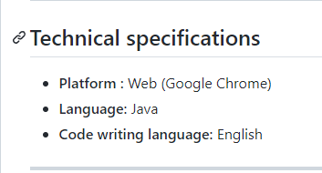
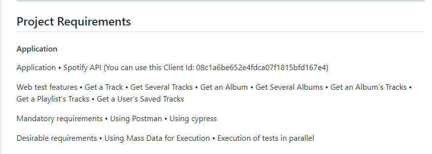
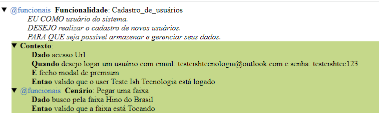

# DesafioQA

Projeto feito em JAVA

Antes de olhar o projeto leia essas informações:

Relatório HTML encontra-se na pasta DesafioQA/target/report-html/ e as screenshots encontram-se na pasta DesafioQA/target/screenshot/

Para não problema em rodar a feature entre no link siga o passo a passo: encurtador.com.br/BGX08

Qualquer dúvida sobre o projeto ou sugestões de melhorias, madar e-mail para patrick_avila99@outlook.com

Como visto na imagem acima, foi pedido que o projeto seja feito em java.

Seguindo oq foi pedido, criei uma collection para fazer os gets via api do spotify via postman (Está junto no repositorio).

Exemplo de como vem o relátorio que está na pasta target. É um arquivo HTML então é de facil acesso